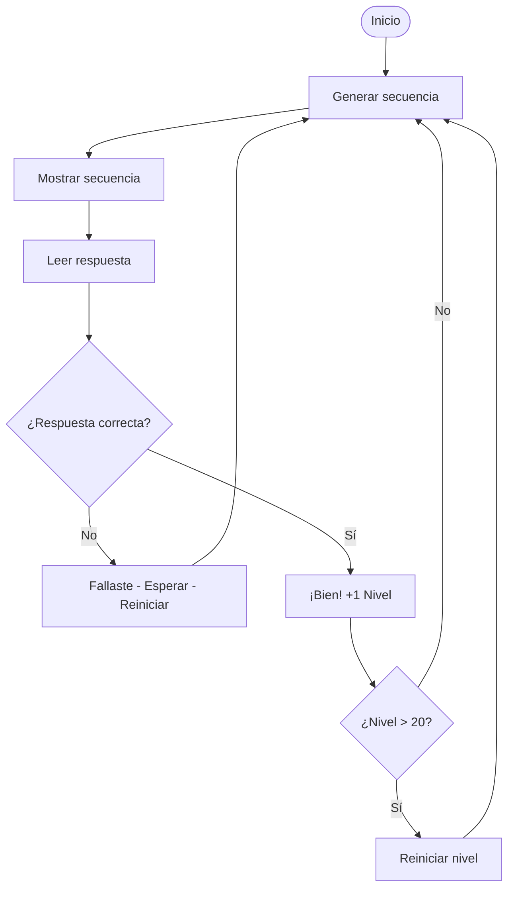

# memoria_dual

an arduino game that’s more expensive than fun

```mermaid
graph TD
    Start([Inicio])
    Gen[Generar secuencia]
    Show[Mostrar secuencia]
    Input[Leer respuesta]
    Correct{¿Respuesta correcta?}
    Fail[Fallaste - Esperar - Reiniciar]
    Win[¡Bien! +1 Nivel]
    Max{¿Nivel > 20?}
    Reset[Reiniciar nivel]

    Start --> Gen
    Gen --> Show --> Input --> Correct

    Correct -- No --> Fail --> Gen
    Correct -- Sí --> Win --> Max
    Max -- Sí --> Reset --> Gen
    Max -- No --> Gen
```
